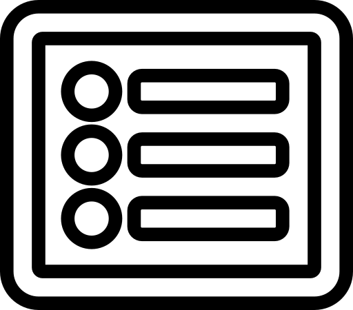

<!--
*** Thanks for checking out the Best-README-Template. If you have a suggestion
*** that would make this better, please fork the repo and create a pull request
*** or simply open an issue with the tag "enhancement".
*** Thanks again! Now go create something AMAZING! :D
***
***
***
*** To avoid retyping too much info. Do a search and replace for the following:
*** pradoplucas, projectTCC, pradoplucas, lucaspinto@alunos.utfpr.edu.br, projectTCC, project_description
-->

<!-- PROJECT SHIELDS -->
<!--
*** I'm using markdown "reference style" links for readability.
*** Reference links are enclosed in brackets [ ] instead of parentheses ( ).
*** See the bottom of this document for the declaration of the reference variables
*** for contributors-url, forks-url, etc. This is an optional, concise syntax you may use.
*** https://www.markdownguide.org/basic-syntax/#reference-style-links
-->

<!-- PROJECT LOGO -->
<br />
<p align="center">
  <a href="https://github.com/pradoplucas/projectTCC">
    
  </a>

  <h3 align="center">projectTCC</h3>

  <p align="center">
    Este é um projeto desenvolvido como Trabalho de Conclusão de Curso (TCC) no curso de Engenharia de Computação na Universidade Tecnológica Federal do Paraná câmpus Cornélio Procópio (UTFPR-CP)
    <br />
    <a href="https://github.com/pradoplucas/projectTCC"><strong>Documentação »</strong></a>
    <br />
    <br />
    <a href="https://github.com/pradoplucas/projectTCC">Ver Projeto</a>
    ·
    <a href="https://github.com/pradoplucas/projectTCC/issues">Reportar Bug</a>
    ·
    <a href="https://github.com/pradoplucas/projectTCC/issues">Requisitar Funcionalidade</a>
  </p>
</p>

<!-- TABLE OF CONTENTS -->
<details open="open">
  <summary><h2 style="display: inline-block">Tabela de Conteúdos</h2></summary>
  <ol>
    <li>
      <a href="#sobre-o-projeto">Sobre o Projeto</a>
      <ul>
        <li><a href="#desenvolvido-com">Desenvolvido com</a></li>
      </ul>
    </li>
    <li>
      <a href="#começando">Começando</a>
      <ul>
        <li><a href="#pré-requisitos">Pré-requisitos</a></li>
        <li><a href="#instalação">Instalação</a></li>
      </ul>
    </li>
    <!--
    <li><a href="#usage">Usage</a></li>
    <li><a href="#roadmap">Roadmap</a></li>
    <li><a href="#contributing">Contributing</a></li>
-->
    <li><a href="#licença">Licença</a></li>
    <li><a href="#contato">Contato</a></li>
    <li><a href="#reconhecimentos">Reconhecimentos</a></li>
  </ol>
</details>

<!-- ABOUT THE PROJECT -->

## Sobre o Projeto

[![Product Name Screen Shot][product-screenshot]](https://example.com)

### Desenvolvido com

-   [Archiver](https://www.npmjs.com/package/archiver)
-   [Bcryptjs](https://www.npmjs.com/package/bcryptjs)
-   [Bootstrap](https://getbootstrap.com/)
-   [Del](https://www.npmjs.com/package/del)
-   [Dotenv](https://www.npmjs.com/package/dotenv)
-   [Express](https://www.npmjs.com/package/express)
-   [Express-handlebars](https://www.npmjs.com/package/express-handlebars)
-   [Express-session](https://www.npmjs.com/package/express-session)
-   [Mongodb](https://www.mongodb.com/)
-   [Mongoose](https://www.npmjs.com/package/mongoose)
-   [Multer](https://www.npmjs.com/package/multer)
-   [NodeJS](https://nodejs.org/en/)
-   [Nodemailer](https://www.npmjs.com/package/nodemailer)
-   [Passport](https://www.npmjs.com/package/passport)

<!-- GETTING STARTED -->

## Começando

Para executar este sistema de maneira local, é necessário seguir os passos descritos abaixo.

### Pré-requisitos

Primeiramente, tenha instalado o NodeJS (14.17.5) e o gerenciador de pacotes npm (6.14.13).

-   npm

    ```sh
    npm install npm@latest -g
    ```

### Instalação

1. Clone o repositório

    ```sh
    git clone https://github.com/pradoplucas/projectTCC.git
    ```

2. Instale os pacotes npm

    ```sh
    npm install
    ```

3. Observe o arquivo .envConfig

4. Crie um arquivo .env com as exatas instruçoes presentes no arquivo .env

5. Execute o servidor

    ```sh
    npm run dev
    ```

6. Abra o navegador e entre no link

    ```sh
    http://localhost:3000
    ```

<!-- USAGE EXAMPLES

## Uso

Use this space to show useful examples of how a project can be used. Additional screenshots, code examples and demos work well in this space. You may also link to more resources.

_For more examples, please refer to the [Documentation](https://example.com)_
 -->
<!-- ROADMAP

## Futuro

See the [open issues](https://github.com/pradoplucas/projectTCC/issues) for a list of proposed features (and known issues).
-->
<!-- CONTRIBUTING

## Contribuição

Contributions are what make the open source community such an amazing place to be learn, inspire, and create. Any contributions you make are **greatly appreciated**.

1. Fork the Project
2. Create your Feature Branch (`git checkout -b feature/AmazingFeature`)
3. Commit your Changes (`git commit -m 'Add some AmazingFeature'`)
4. Push to the Branch (`git push origin feature/AmazingFeature`)
5. Open a Pull Request
-->
<!-- LICENSE -->

## Licença

Distribuído sob a licença MIT.

<!-- CONTACT -->

## Contato

Lucas do Prado Pinto - [@pradoplucas](https://twitter.com/pradoplucas) - lucaspinto@alunos.utfpr.edu.br

Link do projeto: [https://github.com/pradoplucas/projectTCC](https://github.com/pradoplucas/projectTCC)

<!-- ACKNOWLEDGEMENTS -->

## Reconhecimentos

-   [Font Awesome](https://fontawesome.com)
-   [Othneil Drew](https://github.com/othneildrew/Best-README-Template)
-   [Pixabay](https://pixabay.com/)
-   [Unplash](https://unsplash.com/)

<!-- MARKDOWN LINKS & IMAGES -->
<!-- https://www.markdownguide.org/basic-syntax/#reference-style-links -->

[contributors-shield]: https://img.shields.io/github/contributors/pradoplucas/repo.svg?style=for-the-badge
[contributors-url]: https://github.com/pradoplucas/projectTCC/graphs/contributors
[forks-shield]: https://img.shields.io/github/forks/pradoplucas/repo.svg?style=for-the-badge
[forks-url]: https://github.com/pradoplucas/projectTCC/network/members
[stars-shield]: https://img.shields.io/github/stars/pradoplucas/repo.svg?style=for-the-badge
[stars-url]: https://github.com/pradoplucas/projectTCC/stargazers
[issues-shield]: https://img.shields.io/github/issues/pradoplucas/repo.svg?style=for-the-badge
[issues-url]: https://github.com/pradoplucas/projectTCC/issues
[license-shield]: https://img.shields.io/github/license/pradoplucas/repo.svg?style=for-the-badge
[license-url]: https://github.com/pradoplucas/projectTCC/blob/master/LICENSE.txt
[linkedin-shield]: https://img.shields.io/badge/-LinkedIn-black.svg?style=for-the-badge&logo=linkedin&colorB=555
[linkedin-url]: https://linkedin.com/in/pradoplucas
[product-screenshot]: static/assets/images/logo/index.png
